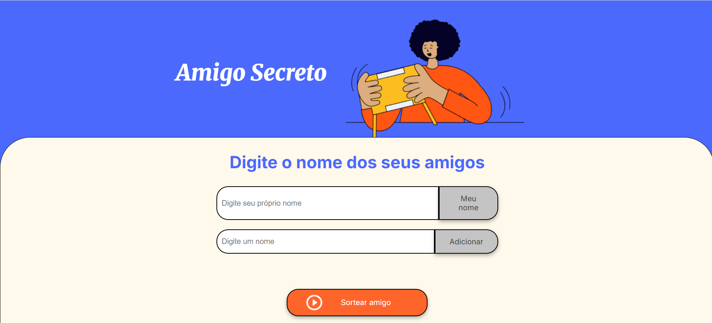
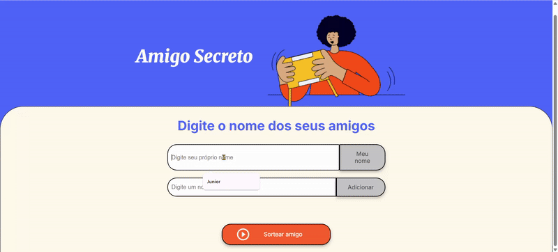

# Amigo Secreto

  

## Índice
- [Descrição do Projeto](#descrição-do-projeto)
- [Status do Projeto](#status-do-projeto)
- [Funcionalidades](#funcionalidades)
- [Demonstração](#demonstração)
- [Acesso ao Projeto](#acesso-ao-projeto)
- [Tecnologias Utilizadas](#tecnologias-utilizadas)
- [Desenvolvedores](#desenvolvedores)
- [Licença](#licença)

## Descrição do Projeto
Aplicação web simples para gerenciar um “Amigo Secreto”:  
O usuário cadastra participantes, define seu próprio nome para não entrar no sorteio, adiciona amigos, e ao clicar em “Sortear amigo” vê na tela quem foi escolhido.  
Acompanhado de fala (`responsiveVoice.speak()`) e confetes.

## Status do Projeto
Finalizado.

## Funcionalidades
- Cadastro de participantes  
- Definição de “meu nome” para exclusão no sorteio  
- Sorteio aleatório com feedback visual  
- Animação de confete e fala via `responsiveVoice.speak()`

## Demonstração

### Captura de tela

### GIF de Demonstração

## Acesso ao Projeto
O projeto está disponível em:  
https://github.com/GelsonRibeiroJr/challenge-amigo-secreto_pt

## Tecnologias Utilizadas
- HTML5  
- CSS3  
- JavaScript (ES6)  
- [Canvas Confetti](https://www.npmjs.com/package/canvas-confetti)  
- [ResponsiveVoice](https://responsivevoice.org/)

## Desenvolvedores
Gelson Ribeiro

## Licença
Este projeto está licenciado sob a [MIT License](LICENSE).
